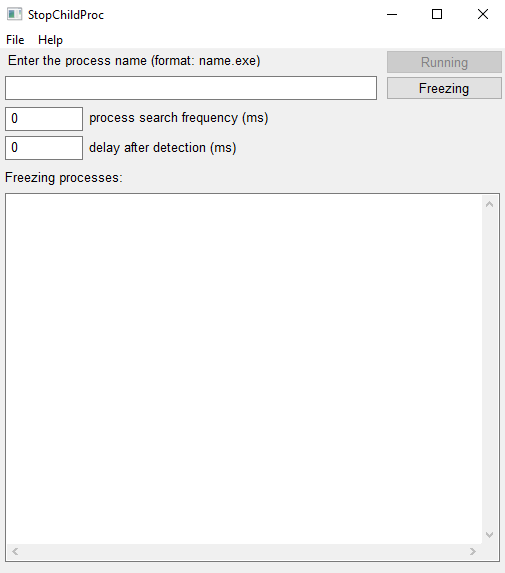
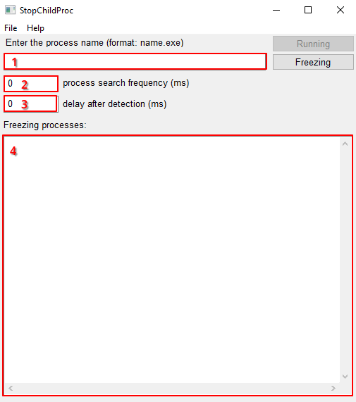
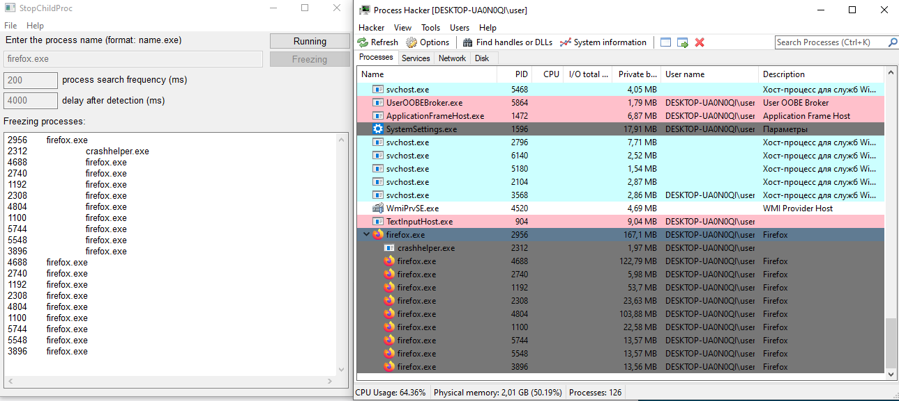

## StopChildProc

Программа ищет и замораживает дочерние процессы.

1. Окно ввода имени процесса (например firefox.exe);
2. Окно ввода задержки между циклами по поиску и заморозки дочерних процессов (в мс);
3. Окно ввода задержки перед первым циклом поиска дочерних процессов и их заморозкой после первого обнаружения искомого процесса (в мс);
4. Окно вывода дерева замороженных процессов.

